---

🎬 MovieApp — iOS-додаток на Swift / UIKit для перегляду фільмів та серіалів, їх трейлерів та акторів, з можливістю пошуку та додавання до списку улюблених. Використовує TMDb API.

---

🔗 TMDb Disclaimer
- This product uses the TMDB API but is not endorsed or certified by TMDB.

---

🔍 Основні можливості

- Пошук фільмів/серіалів, зроби вибір улюбленого жанру
- Перегляд популярних та трендових релізів
- Детальні сторінки з інформацією про фільм/серіал і акторів
- Перегляд трейлерів через YouTube
- Додавання у список улюблених
- Ділитися з друзями (Telegram, Twitter, Share)
- Passcode‑екран для захисту
  
---

🏛 Архітектура

- MVP архітектура з пошаровим поділом Data / Domain / Presentation, пасивним UI, навігацією через Routers та Builder як composition root.
- Presenter містить всю бізнес‑логіку(у майбутньому UseCase).
- ViewController відповідає лише за UI lifecycle та відображення.

- Layered separation (Data / Domain / Presentation)
- Router‑based navigation — навігація відокремлена від UI.
- Builder як Composition Root — централізована збірка модулів та DI.

🧩 Шари
- Data Layer - NetworkService - універсальний HTTP-клієнт, що відповідає за формування запитів. 
             - Repository - інкапсулює джерела даних і виконує мапінг DTO → Domain.
  
- Domain Layer — бізнес‑логіка, моделі, незалежні від UI та мережі.
  
- Presentation Layer — ViewControllers + Presenters + ViewModels, пасивний UI.
  
---

🌐 Мережеві дані

- TMDb API
- Асинхронні запити з використанням async / await
- Типобезпечні Endpoint-и

---

💾 Робота з даними

- CoreData — збереження вибраного
- Keychain — Passcode (у майбутньому Auth)
- Kingfisher — завантаження та кешування зображень
  
---

📱 UI побудований на UIKit

- Layout секцій генерується через LayoutFactory.
- Cells конфігуруються через ViewModels.
  
- UICollectionView (CompositionalLayout & FlowLayout)
- UITableView
- UITabBarController
- UIStackView
- NSLayoutConstraint

---

📱 Скріншоти

### 🏠 Main Screen

  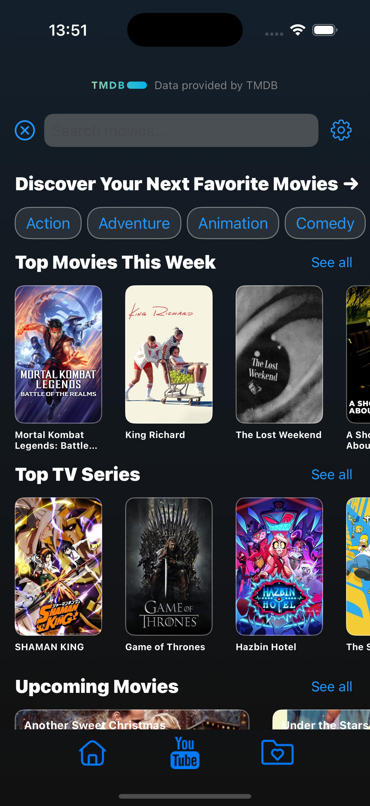
  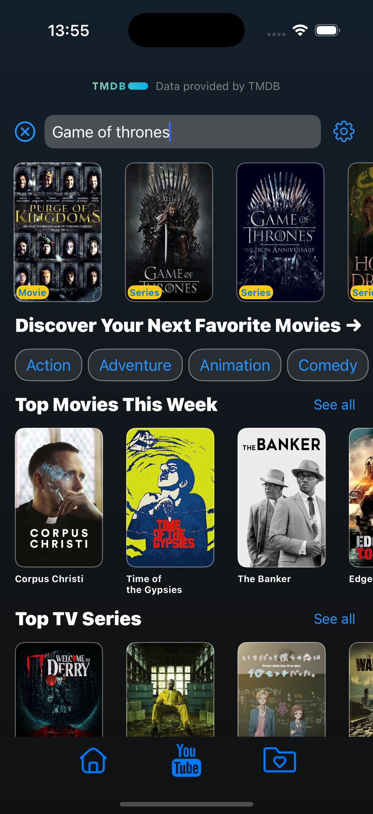

### 🎬 Movie Page

  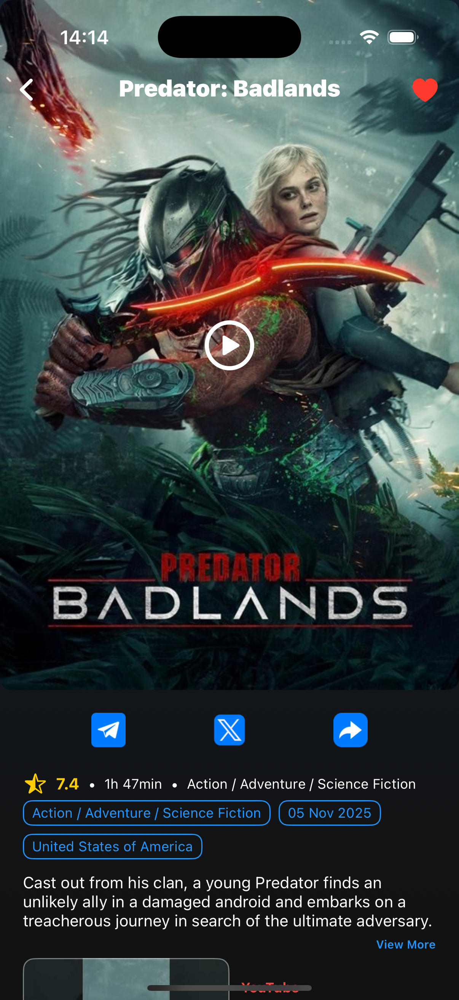
  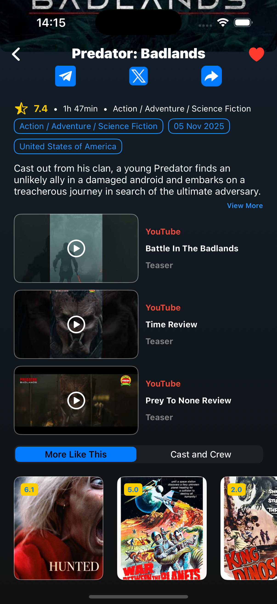
  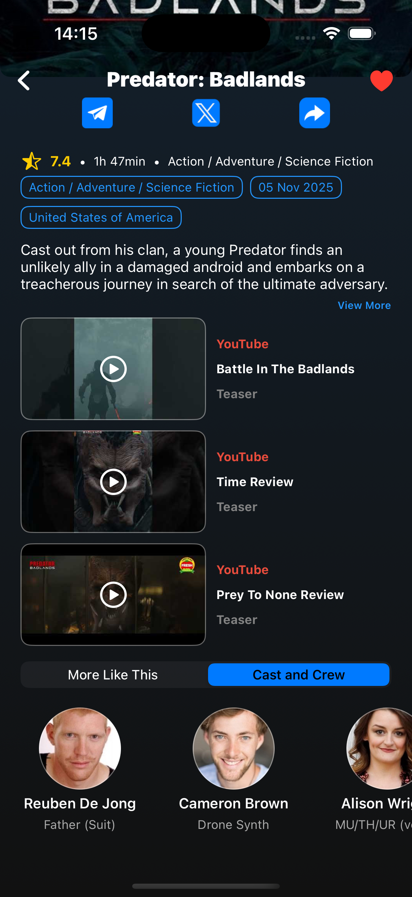

### 📺 TV Series Page

  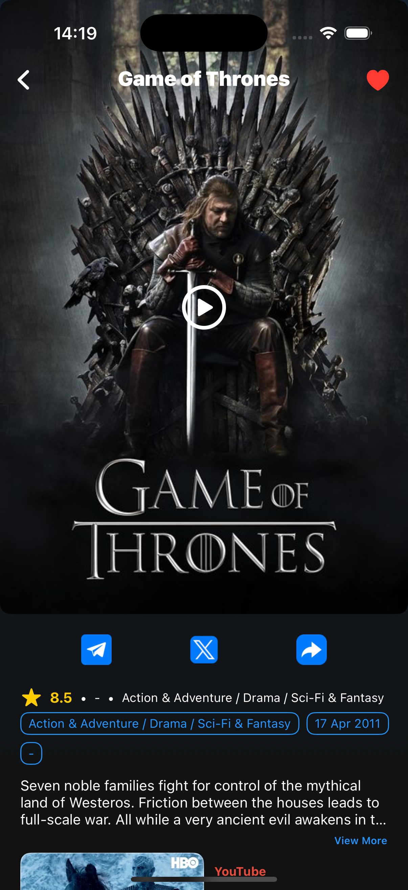
  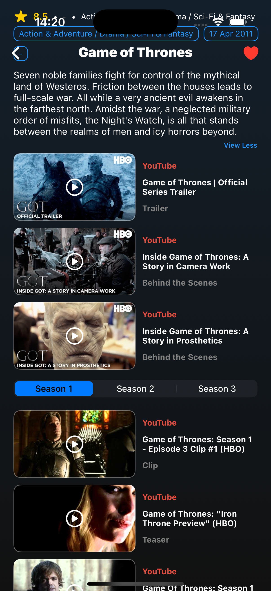
  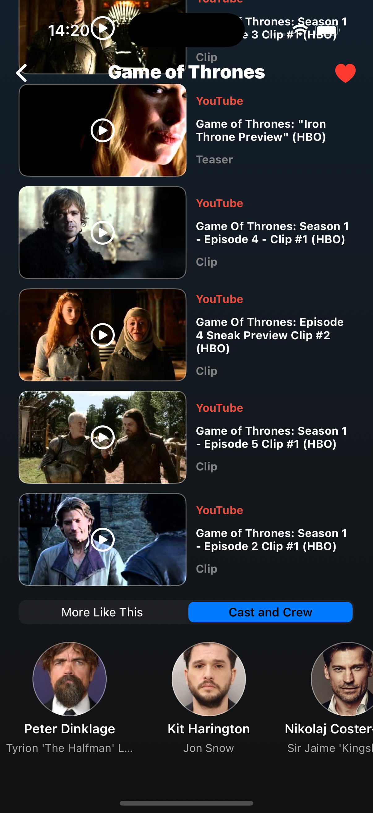

### 👤 Actor Page

  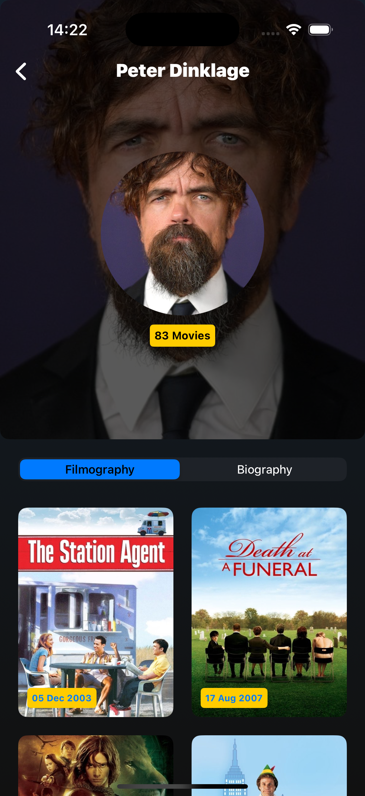
  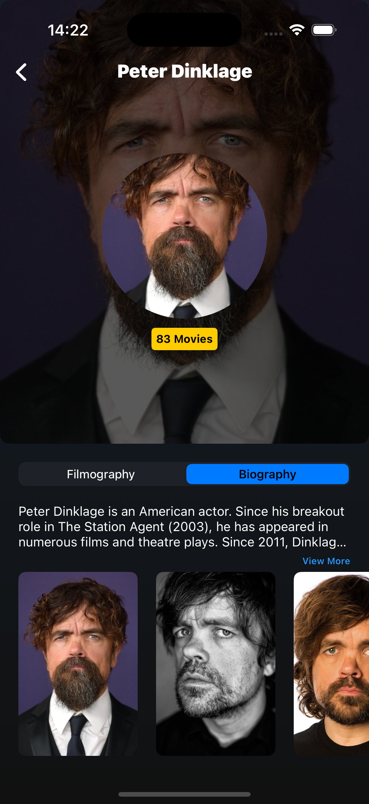

### 📦 Passcode / Settings / DynamicList / Player

  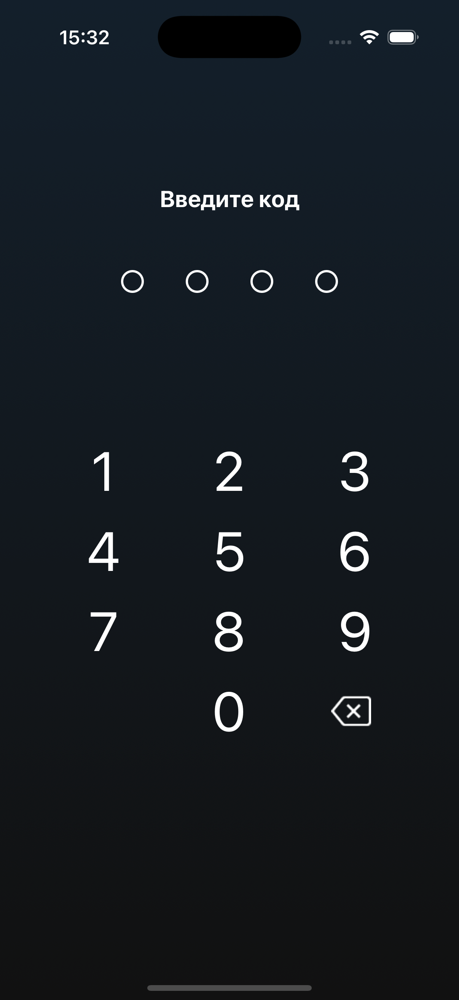
  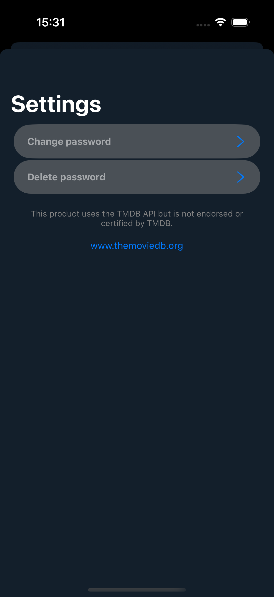
  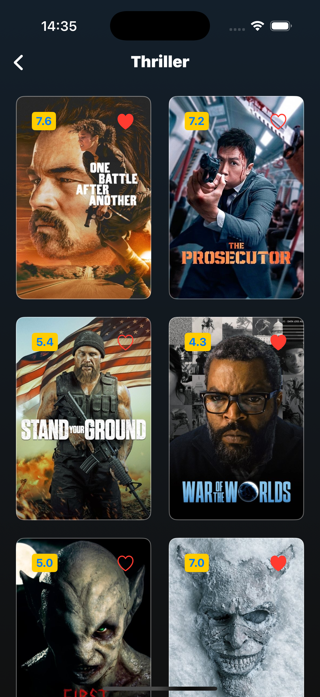
  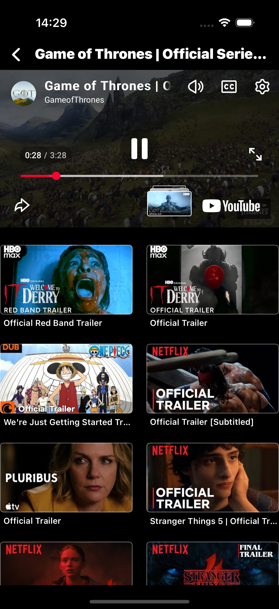

